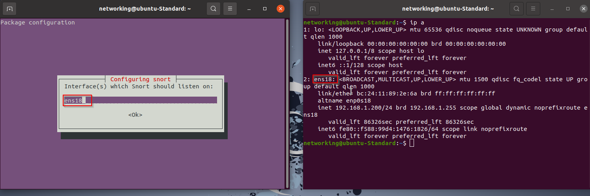
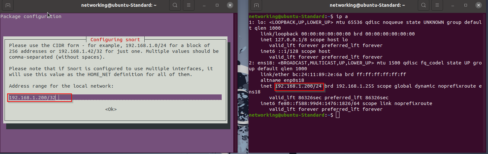
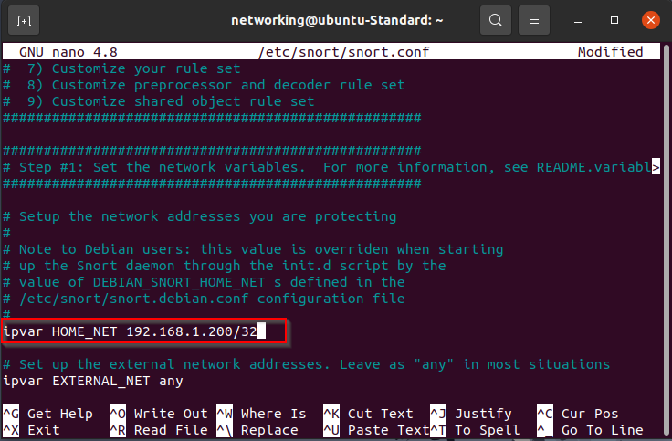
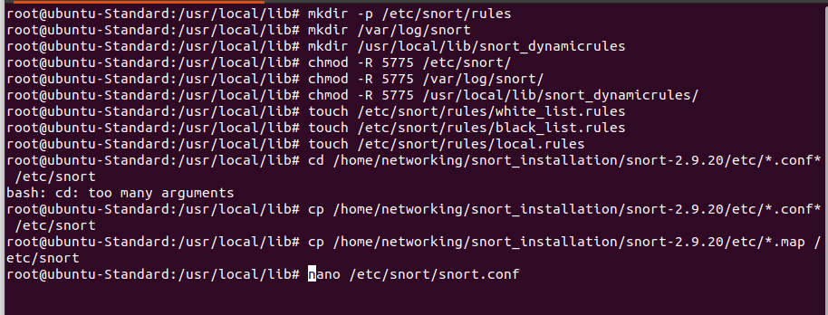
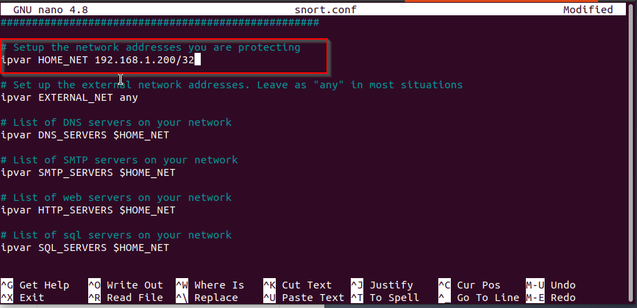
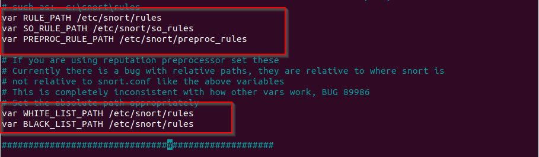
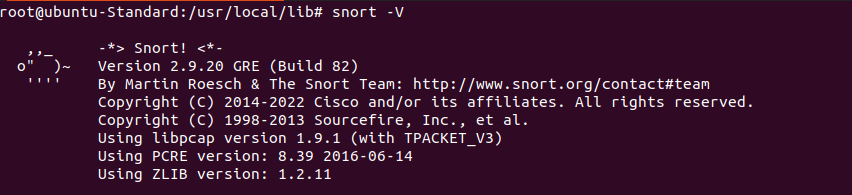

## What is Snort and how does it function as an IDS?

Snort monitors network traffic in real-time and matches it against predefined rule sets to detect potential security threats. It works by analyzing packet headers and payloads to identify malicious patterns, such as port scans, buffer overflows, or malware communication. Snort is a widely used, open-source Intrusion Detection System (IDS) known for its versatility and can act as an IDS, Intrusion Prevention System (IPS), or even as a simple packet sniffer.

### How Snort Works:
- Snort inspects packets at various layers (IP, TCP, UDP, and Application Layer).
- It uses rules-based detection to flag suspicious traffic.
- It can log packets, send alerts, or block traffic (when used as an IPS).
- **Simple Example**: Imagine a traffic police officer standing at a checkpoint (Snort). They inspect every passing vehicle (packet) and flag those that violate rules (malicious traffic).

## Features of Snort: Packet logging, real-time traffic analysis, protocol analysis

Snort is equipped with several features that make it a robust IDS. Below are the key functionalities:

### 1. **Packet Logging**:
- Captures and saves packet details for further analysis.
- Logs include headers, payloads, and other metadata, allowing detailed investigations.
- **Example**: If an attacker sends malicious payloads via HTTP, Snort can log the full HTTP request for later review.

### 2. **Real-Time Traffic Analysis**:
- Monitors live network traffic and identifies potential threats immediately.
- Generates alerts when suspicious patterns match its rules.
- **Example**: During a **SYN flood attack**, Snort detects repeated SYN packets from a single IP address and alerts the administrator.

### 3. **Protocol Analysis**:
- Examines specific protocols (e.g., HTTP, FTP, DNS) to identify misuse or attacks.
- Detects anomalies, such as malformed packets or unexpected protocol behaviors.
- **Example**: Snort identifies an **HTTP request smuggling attack** by analyzing unusual HTTP headers.

### 4. **Extensive Rule Set**:
- Comes with a comprehensive set of predefined rules.
- Custom rules can also be written to target organization-specific threats.
- **Example**: A custom Snort rule can be created to detect unauthorized SSH attempts.

## Installing Snort: Overview of system requirements and installation steps

### **System Preparation**
1. **Update System Packages and Snort Installation**  
Run the following command to ensure your system is up to date and install snort using apt:  
```
sudo apt update && sudo apt upgrade -y sudo apt install snort -y
```

During Installation mention the interface name (e.g. ens18 or eth0) you want snort to listen.


Then enter your IP to run snort as Host-Based IDS (e.g. 192.168.1.200/32)


Lastly, change the var HOME_NET.


In case you want to install snort from source file, after system upgrade follow the below mentioned steps.

### 1. **Install Required Dependencies**  
Install the essential libraries and tools that Snort and DAQ need to compile and run:   
```
sudo apt install -y gcc libpcre3-dev zlib1g-dev libluajit-5.1-dev libpcap-dev openssl libssl-dev libnghttp2-dev libdumbnet-dev bison flex libdnet autoconf libtool
```

### Installing DAQ Library
1. **Create a Directory for Snort Installation**  
Organize all the files in one place:
```
mkdir snort_installation && cd snort_installation
```

2. **Download and Extract DAQ**  
Download the compatible DAQ version from Snort's official website:   
```
wget https://www.snort.org/downloads/daq/daq-2.0.7.tar.gz tar -xzvf daq-2.0.7.tar.gz cd daq-2.0.7
```

3. **Build and Install DAQ**  
Configure, build, and install the DAQ library:   
```
autoreconf -f -i && ./configure && make && sudo make install && cd ..
```

### **Installing Snort**
1. **Download and Extract Snort**  
Get the Snort source code and extract it:   
```
wget https://www.snort.org/downloads/snort/snort-2.9.20.tar.gz tar -xvzf snort-2.9.20.tar.gz cd snort-2.9.20
```

2. **Build and Install Snort**  
Run the following commands to configure, compile, and install Snort:
```
./configure --enable-sourcefire && make && sudo make install
```

3. Copy Files from local Downloaded folder to `/etc`:
```
sudo mkdir -p /etc/snort/rules
sudo mkdir /var/log/snort
sudo mkdir /usr/local/lib/snort_dynamicrules
sudo chmod -R 5775 /etc/snort
sudo chmod -R 5775 /var/log/snort
sudo chmod -R 5775 /usr/local/lib/snort_dynamicrules
sudo touch /etc/snort/rules/white_list.rules
sudo touch /etc/snort/rules/black_list.rules
sudo touch /etc/snort/rules/local.rules
sudo cp ~/snort_installation/snort-2.9.16/etc/.conf /etc/snort
sudo cp ~/snort_installation/snort-2.9.16/etc/*.map /etc/snort
```


Now we need to do some changes in `/etc/snort/snort.conf` file as per the following screenshots:




### **Verify Snort Installation**

**Check Snort Version**  
After installation, confirm that Snort is installed and working:

```
snort -V
```


The topics covered in this short series form the backbone of cybersecurity, but the field is ever-evolving. The next step could involve exploring advanced threat detection techniques, such as machine learning in network security or integrating IDS with SIEM platforms for centralized incident management. Deepening your skills in threat hunting, vulnerability management, or offensive security tools like Metasploit can further enhance your expertise.


