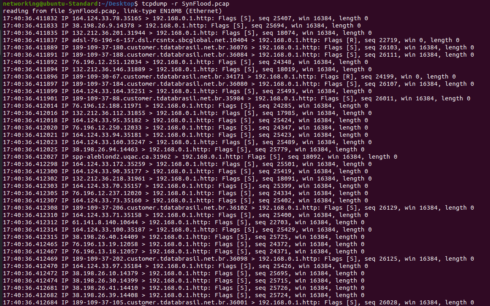
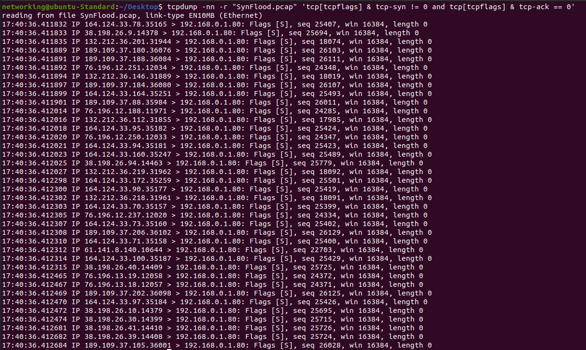
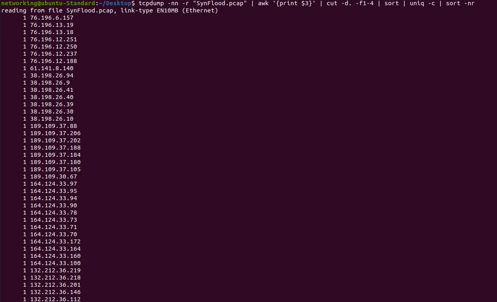

# TCPDump: A Tool for Network Traffic Analysis

**TCPDump** is a powerful, command-line-based packet capture tool used by network professionals to analyze and troubleshoot network traffic. 

### **Think of it as**: 
A digital magnifying glass that lets you see the individual packets flowing through your network.

### **Why It’s Useful**: 
Lightweight, flexible, and ideal for capturing real-time network data.

---

## Installing TCPDump

### **On Ubuntu 20.04 (or other Debian-based systems)**:
1. **Update the package list**:
    ```
    sudo apt update
    ```

2. **Install TCPDump**:
    ```
    sudo apt install tcpdump -y
    ```

3. **Verify installation**:
    ```
    tcpdump --version
    ```

### **On CentOS/RHEL**:
1. **Install using yum or dnf**:
    ```
    sudo yum install tcpdump -y
    ```

    or

    ```
    sudo dnf install tcpdump -y
    ```

### **On macOS**:
Use Homebrew:
```
brew install tcpdump
```

### **On Windows**:
TCPDump is not directly available on Windows, but you can use WinDump, a Windows port of TCPDump. You’ll also need WinPcap for packet capture.

## TCPDump Basics: Capturing Packets

### Basic Syntax
```
	tcpdump [options] [expression]
```
1. **Capture Packets on a Specific Interface:**:
    ```
    sudo tcpdump -i eth0
    ```
    - Captures all packets on the interface `eth0`.
	- Use `tcpdump -D` to list available interfaces.

2. **Save Packets to a File**:
    ```
    sudo tcpdump -i eth0 -w capture.pcap
    ```
    Saves packets to capture.pcap for later analysis with tools like Wireshark.

3. **Read Packets from a File:**:
    ```
    tcpdump -r capture.pcap
    ```
    to look at the payload of saved pcap
    ```
    tcpdump -qns 0 -X -r capture.pcap
    ```

4. **Display Packet Summary:**:
    ```
    sudo tcpdump -n
    ```
    The -n option disables hostname resolution for faster output.

# Analysis of a SYN Flood Attack

## Introduction to the Attack
A **SYN flood attack** exploits the TCP three-way handshake mechanism by sending numerous SYN packets to a server without completing the handshake, exhausting the server's resources. Analyzing such attacks with TCPDump can help pinpoint the attack source, target, and characteristics.

## About the PCAP File
The PCAP file uploaded is an example of a **SYN Flood Attack**, where a large number of TCP SYN packets overwhelm a server's resources, disrupting legitimate connections. This file originates from the link: [Cloudshark SYN Flood Capture](https://www.cloudshark.org/captures/ba85949942a0).

## Step-by-Step TCPDump Analysis

### 1. Load the PCAP File
Start by reading the PCAP file:
```
tcpdump -r "SynFlood.pcap"
```



- What happens: This command displays all packets sequentially. Look for an unusually high number of SYN packets.

### 2. Filtering SYN Packets
Focus specifically on **TCP SYN packets**:
```
tcpdump -nn -r "SynFlood.pcap" 'tcp[tcpflags] & tcp-syn != 0 and tcp[tcpflags] & tcp-ack == 0'
```



- Purpose: Captures SYN packets where the ACK flag is not set, indicating handshake initiation without acknowledgment.
- Observation: You’ll see a repeated pattern of SYN packets from one or multiple source IPs targeting a specific port.
### 3. Identifying Attacker IP Addresses
			Extract and count the source IP addresses involved in the attack:
```
tcpdump -nn -r "SynFlood.pcap" | awk '{print $3}' | cut -d. -f1-4 | sort | uniq -c | sort -nr
```



#### Outcome:
- The command lists all unique source IPs and their frequencies.
- High-frequency IPs are likely the attackers.

### 4. Finding the Target Port
Determine which port is being overwhelmed:
```
tcpdump -nn -r "SynFlood.pcap" | awk '{print $5}' | cut -d. -f2 | sort | uniq -c | sort -nr
```
- Explanation: Displays target ports by their frequency of occurrence.

### 5. Inspecting Individual Packets
To view details of a specific packet, use:
```
tcpdump -nn -r "SynFlood.pcap" -v -c 1
```
#### Details Provided:
- Source IP, destination IP, source port, destination port, and flags.
- Useful for confirming the attack characteristics.

Using TCPDump for SYN flood analysis provides deep insights into attack patterns. By identifying attacker IPs, targeted services, and packet rates, you can design effective mitigation strategies, such as IP filtering and rate limiting.


