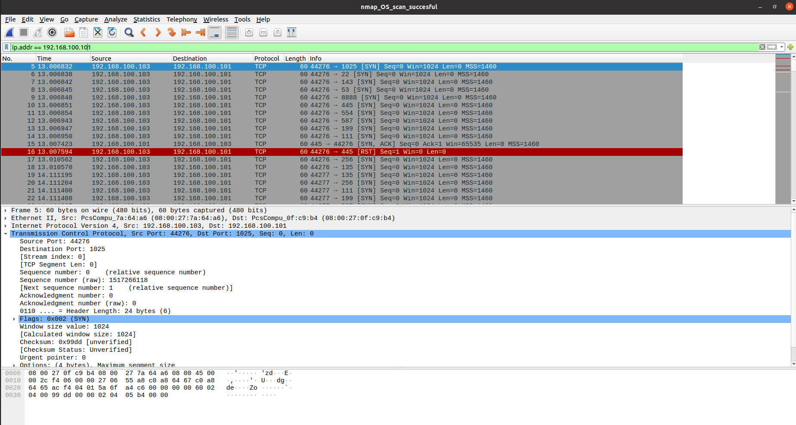

## 1. Introduction to Wireshark
Wireshark is one of the most popular open-source tools for network traffic analysis and troubleshooting. It captures packets in real-time and provides an in-depth view of the data being transmitted across a network.

**Key Features:**
- Supports hundreds of protocols (e.g., TCP, UDP, HTTP, DNS).
- Provides intuitive graphical and textual interfaces for analysis.
- Filters and color codes traffic for easier interpretation.
- Useful for detecting network anomalies, attacks, and performance bottlenecks.

---

## 2. Installation of Wireshark
Wireshark is available for various operating systems, including Linux, Windows, and macOS.

### On Ubuntu (Linux)
Run the following commands in your terminal:
```
sudo apt update sudo apt install wireshark
```
During the installation, you’ll be prompted to allow non-superusers to capture packets. Choose "Yes" for convenience.  
After installation, run Wireshark:
```
wireshark
```
### On Windows
- Download the installer from the official Wireshark website.
- Follow the installation wizard and ensure **WinPcap** or **Npcap** (packet capture libraries) are installed.
- Launch Wireshark from the start menu.

### On macOS
Install Wireshark using Homebrew:
```
brew install wireshark
```

Ensure permissions are set for packet capturing.

---

## 3. Packet Analysis: Understanding Packets, Frames, and Protocols
We’ll use the provided PCAP file, `nmap_OS_scan_successful`, sourced from [Wireshark Sample Captures](https://wiki.wireshark.org/samplecaptures), to illustrate packet analysis.

### Loading the PCAP File
- Open Wireshark.
- Navigate to **File > Open** and select the `nmap_OS_scan_successful` PCAP file.

### Understanding the Data Structure
- **Frames**: Represent the physical layer. Each frame corresponds to a captured packet.
- **Packets**: Encapsulate protocol data (e.g., Ethernet, IP, TCP).
- **Protocols**: Provide the logic for communication (e.g., ARP, DNS, HTTP).

### Example Analysis from PCAP
**Nmap OS Scan**: Look for ICMP packets. Nmap sends crafted probes to determine OS characteristics.  
Apply a filter to focus on ICMP:
```
icmp
```


- Inspect the Type and Code fields in the packet details pane to understand echo requests/replies.
- Highlight anomalies, such as unusually structured requests or TTL manipulations.

### Filtering captured traffic: Display filters, color coding

**Filtering with Display Filters**
- Filters narrow down packets for easier analysis. Example filters:
- Filter for TCP Traffic:

```
	tcp
```


- Filter for specific IP:
```
		ip.addr == 192.168.100.101
```



**Color Coding**
- Wireshark uses colors to differentiate traffic types:
- Light green: TCP traffic.
- Dark blue: DNS queries.
- Black: Errors or malformed packets.
- Customize colors via View > Coloring Rules.

## Practical Analysis of C2 Foudre Backdoor Traffic Using Wireshark
In this case study, we analyze a Command and Control (C2) Backdoor attack using a PCAP file titled "C2 Foudre Backdoor Traffic with DGA" (Domain Generation Algorithm). The goal is to break down the traffic patterns and uncover malicious activities that enable attackers to control compromised systems remotely.

The PCAP file, sourced from[ PCAP-Attack GitHub Repository]([https://github.com/sbousseaden/PCAP-ATTACK/blob/master/Command%20and%20Control/C2_Foudre_Backdoor_DGA.pcapng]()), provides insights into the C2 communication techniques and how backdoors leverage DNS and HTTP protocols for malicious purposes.


### 1. Initial TCP Handshake
The communication begins with the typical TCP three-way handshake:
- **Packet 1-3:** The client (source IP: 10.0.2.15) initiates a connection to the server (destination IP: 185.56.137.138) on port 80 (HTTP).
- The process involves:
    * SYN: Client sends a synchronization packet to request a connection.
    * SYN-ACK: Server acknowledges the request.
    * ACK: Client completes the handshake.
This reliable TCP session lays the foundation for HTTP communication. Attackers use legitimate protocols like TCP to ensure their activities blend with normal traffic.
		
### 2. HTTP GET Request with Obfuscated Data
**Packet 4:** The client sends an HTTP GET request to the endpoint on the server.
The request contains suspicious query parameters, as shown below:
***GET /de/?d=2020298w&00021&t=202%20ID102%2042%20D7%20D28%20D20 HTTP/1.1***
- Query Analysis:
    * Parameter d=2020298w may serve as an identifier or session key between the malware and the server.
    * Parameter t=202%20ID102%2042%20D7%20D28%20D20 appears encoded or obfuscated, likely to hide its intent from network defenders.
- Headers:
    * User-Agent: The malware masquerades as a legitimate browser, e.g., Mozilla/5.0 (Windows NT 6.1; WOW64; rv:40.0) Gecko/20100101 Firefox/40.1.
    * Cache-Control: no-cache: Prevents local caching, ensuring no trace of malicious activity is left behind.

### 3. Server Response and Command Execution
**Packet 5:** The server responds to the client’s HTTP GET request. This response might:
		- Deliver the payload (backdoor or malicious script) to the infected host.
		- Provide commands for the malware to execute on the compromised system.
		Further investigation of the response content would reveal the exact nature of the interaction, such as whether the payload involves data exfiltration, remote execution, or additional C2 communication.
### 4. Continuous Communication
		Subsequent packets reveal persistent HTTP traffic, indicating:
		- C2 Beaconing: The malware frequently communicates with the server to check for new instructions.
		- Data Uploads: HTTP POST requests may transfer stolen information to the C2 server.
		- DGA Activity: The domains used in this traffic (185.56.137.138) may have been generated using a Domain Generation Algorithm (DGA), allowing the malware to avoid static blacklists.

	
### Commands to Analyze the Traffic
#### 1. Filter the Relevant Traffic: Use Wireshark filters to isolate the malicious traffic:
```
tcp.port == 80 && ip.addr == 185.56.137.138
```
#### 2. Reconstruct the TCP Stream:
- Right-click on any HTTP packet and select Follow > TCP Stream.
- View the full communication, including encoded query parameters and server responses.


#### 3. Inspect the HTTP Headers and Payloads: Expand the HTTP protocol layer in the Wireshark GUI to examine:
- Request methods (e.g., GET, POST).
- Query parameters (d and t).
- Any potential payload or response from the server. 
	
### Behavioral Analysis and Observations
**Malware Characteristics:**
- The backdoor uses obfuscated query strings to transmit commands or identifiers.
- Legitimate-looking User-Agent strings and cache control headers are employed to evade detection.
**C2 Communication:**
- The infected host periodically contacts the server for updates, maintaining a persistent connection.
**DGA Usage:**
- The server IP/domain (185.56.137.138) suggests the use of dynamically generated domains, a common tactic in advanced malware campaigns.